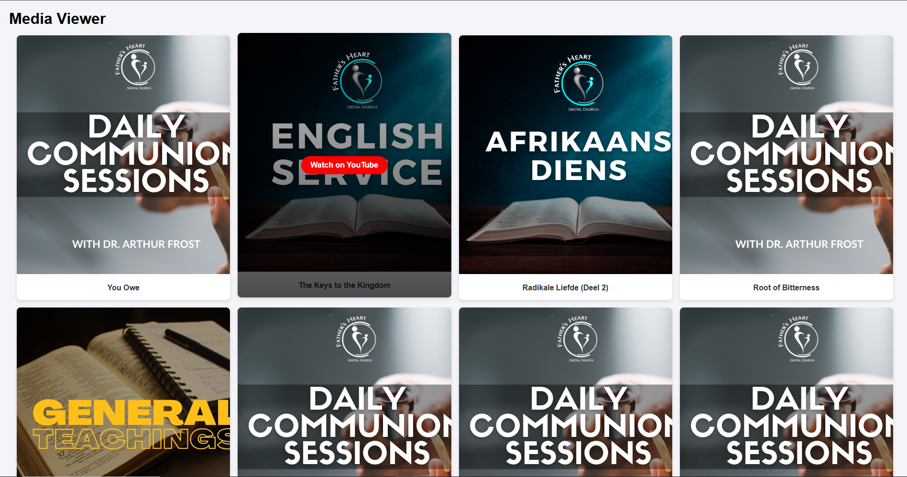

# Media Viewer

A simple React application that fetches and displays media content from a remote API.

## Features
- Fetches timeline content via an Ajax request from a remote PHP API.
- Displays media items (titles, descriptions, images, and icons) in a card-based grid layout.
- Responsive design that adapts to different screen sizes.
- Includes a link to view videos externally on YouTube (if applicable).
- Loads additional media items dynamically as the user scrolls.
- Handles missing media gracefully using placeholders.
- Modern React project setup with Vite for fast development.

## Technologies Used
- React (functional components and hooks)
- Vite (development environment and build tool)
- CSS (for styling cards and layout)
- JavaScript (ES6+ features)

## How to Run Locally

1. Clone the repository:

git clone git@github.com:zandernh/react-media-viewer.git
cd react-media-viewer

2. Install dependencies:

npm install

3. Start development server:

npm run dev

4. Navigate to view application:

Open browser and navigate to http://localhost:5173

## API Details

- Timeline data was fetched from: https://arthurfrost.qflo.co.za/php/getTimeline.php
- Images and icons were loaded from: https://arthurfrost.qflo.co.za/Images/

Audio functionality was not implemented as it was not explicitly required.

## Project Structure

media-viewer/
├── public/
│   └── assets/
├── src/
│   ├── assets/
│   ├── components/
│   │   └── MediaCard.jsx
│   ├── css/
│   │   ├── App.css
│   │   ├── MediaCard.css
│   │   └── index.css
│   ├── App.jsx
│   └── main.jsx
├── .gitignore
├── index.html
├── package.json
├── vite.config.js
└── README.md

## Screenshot

## Notes

- All media content and API endpoints were provided as part of the assessment.
- The application has been built with scalability in mind, allowing for easy future enhancements (e.g., adding audio support, pagination, or search functionality).
- Styling was approached with simplicity and responsiveness in mind to offer a clean user experience.

Please feel free to reach out should you require any clarifications or further improvements.
